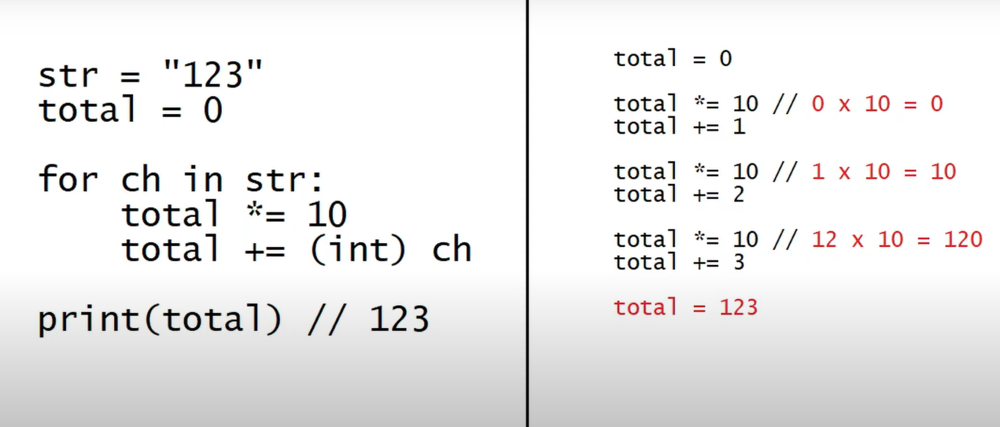
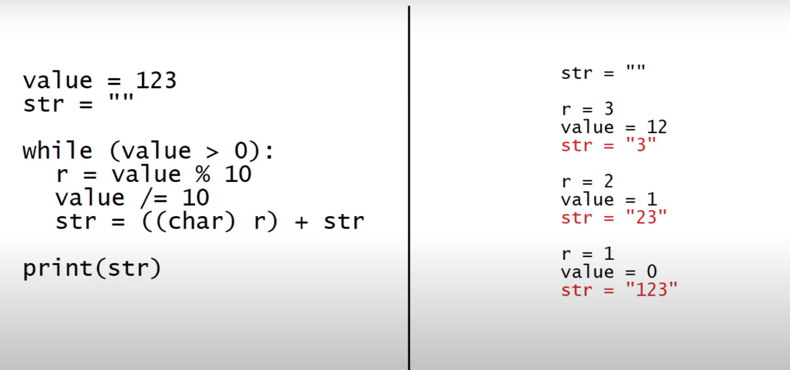

# Calculadora de Média em Assembly **(MASM32)**

O projeto desenvolvido na disciplina de Arquitetura de Computadores I no semestre 2023.1 consiste em um código que recebe três notas do usuário através do console, converte esses valores de ASCII para números inteiros, calcula a média das notas e determina se o aluno foi aprovado, se precisará fazer uma prova final ou se foi reprovado. Além disso, em caso de necessidade de prova final, o programa calculará a nota necessária para o aluno atingir a aprovação. Após esses cálculos, o programa converte o valor da média e, se aplicável, da nota da prova final em representações ASCII e exibe os resultados no console.

## Condições
* Se Média >= 7       (APROVADO)
* Se Média < 4        (REPROVADO)
* Se 4 <= Média < 7   (FINAL)

## Conversão de ASCII para Inteiro
**Algoritmo**

## Conversão de Inteiro para ASCII
**Algoritmo**

## Fórmula da Nota final necessária
F = $(50-media*6)/4$

## Requisitos do Projeto
- [X] Ler 3 notas do Console
- [ ] Tratar a entrada para que seja entre 0 e 10
- [X] Realizar as Conversões
- [X] Calcular a média
- [X] Informar a situação do aluno
- [X] Calcular nota necessária na Final
- [ ] Tratar decimal
